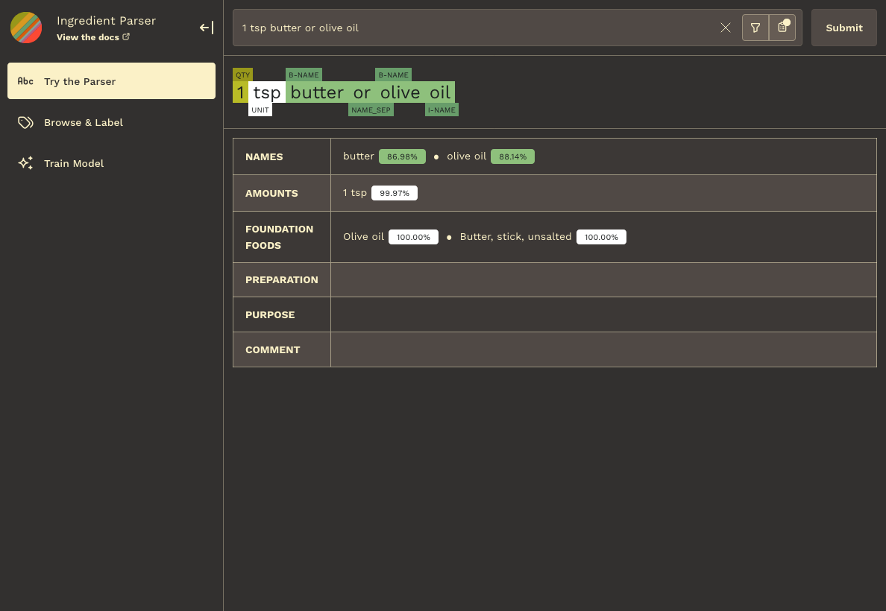
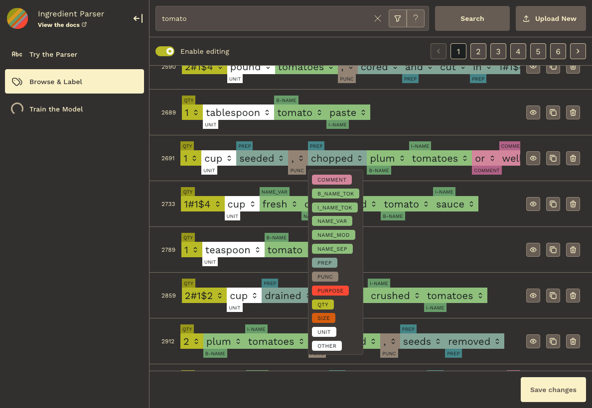
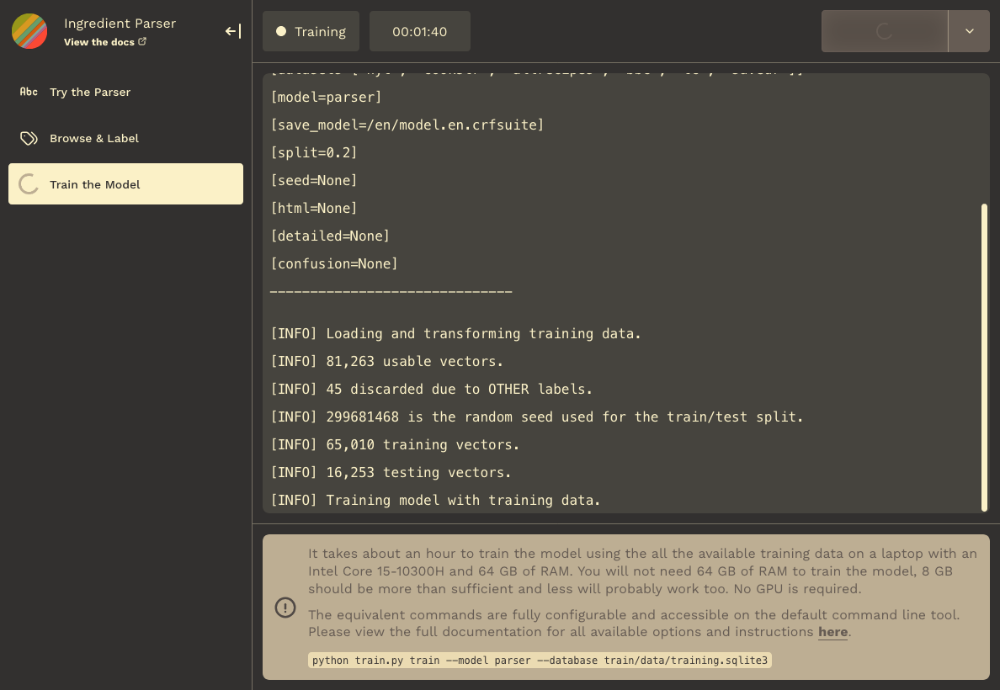

# Ingredient Parser

The Ingredient Parser package is a Python package for parsing structured information out of recipe ingredient sentences.


## Documentation

Documentation on using the package and training the model can be found at https://ingredient-parser.readthedocs.io/.

## Quick Start

Install the package using pip

```bash
$ python -m pip install ingredient-parser-nlp
```

Import the ```parse_ingredient``` function and pass it an ingredient sentence.

```python
>>> from ingredient_parser import parse_ingredient
>>> parse_ingredient("3 pounds pork shoulder, cut into 2-inch chunks")
ParsedIngredient(
    name=[IngredientText(text='pork shoulder', confidence=0.999193)],
    size=None,
    amount=[IngredientAmount(quantity='3',
                             unit=<Unit('pound')>,
                             text='3 pounds',
                             confidence=0.999906,,
                             APPROXIMATE=False,
                             SINGULAR=False)],
    preparation=IngredientText(text='cut into 2 inch chunks', confidence=0.999193),
    comment=None,
    purpose=None,
    foundation_foods=[],
    sentence='3 pounds pork shoulder, cut into 2-inch chunks'
)
```

Refer to the documentation [here](https://ingredient-parser.readthedocs.io/en/latest/start/index.html#optional-parameters) for the optional parameters that can be used with `parse_ingredient` .

## Model

The core of the library is a sequence labelling model that is used to label each token in the sentence with the part of the sentence it belongs to. A data set of 81,000 example sentences is used to train and evaluate the model. See the [Model Guide](https://ingredient-parser.readthedocs.io/en/latest/guide/index.html) in the documentation for mode details.

The model has the following accuracy on a test data set of 20% of the total data used:

```
Sentence-level results:
	Accuracy: 94.66%

Word-level results:
	Accuracy 97.82%
	Precision (micro) 97.81%
	Recall (micro) 97.82%
	F1 score (micro) 97.81%
```

## Development

**Basic**

The development dependencies are in the `requirements-dev.txt` file. Details on the training process can be found in the [Model Guide](https://ingredient-parser.readthedocs.io/en/latest/guide/index.html) documentation.

Before committing anything, install [pre-commit](https://pre-commit.com/) and run
```
pre-commit install
```

to install the pre-commit hooks.

**Web app**

There is a simple web app for testing the parser, browsing the database, labelling entries, and running the basic model.

To run the web app, follow the prior steps on `requirements-dev.txt`, and separately install [Node](https://nodejs.org/en/download), the JS runtime. Once globally installed on your machine, download your packages in the webtools directory with:

```bash
$ npm install
```

After package installs, run dev to start.

```bash
$ npm run dev
```

*tl;dr — inside package.json, `flask` runs the base server, `sockets` runs the web sockets server, and `watch` runs vite build for the react/typescripe bundle — separate flask instances are required to accommodate better web socket behavior*





**Documentation**

The dependencies for building the documentation are in the `requirements-doc.txt` file.
