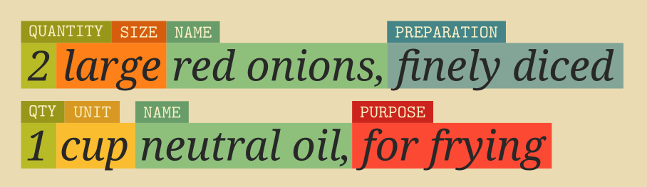
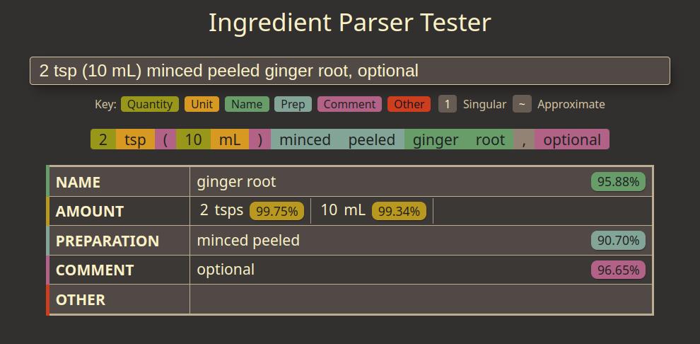

# Ingredient Parser

The Ingredient Parser package is a Python package for parsing structured information out of recipe ingredient sentences.



## Documentation

Documentation on using the package and training the model can be found at https://ingredient-parser.readthedocs.io/.

## Quick Start

Install the package using pip

```bash
$ python -m pip install ingredient-parser-nlp
```

Import the ```parse_ingredient``` function and pass it an ingredient sentence.

```python
>>> from ingredient_parser import parse_ingredient
>>> parse_ingredient("3 pounds pork shoulder, cut into 2-inch chunks")
ParsedIngredient(
    name=IngredientText(text='pork shoulder', confidence=0.999193),
    size=None,
    amount=[IngredientAmount(quantity='3',
                             unit=<Unit('pound')>,
                             text='3 pounds',
                             confidence=0.999906,,
                             APPROXIMATE=False,
                             SINGULAR=False)],
    preparation=IngredientText(text='cut into 2 inch chunks', confidence=0.999193),
    comment=None,
    purpose=None,
    sentence='3 pounds pork shoulder, cut into 2-inch chunks'
)
```

## Model accuracy

The model used for labelling tokens in sentences, provided in the ```ingredient-parser/``` directory, has the following accuracy on a test data set of 20% of the total  data used:

```
Sentence-level results:
	Accuracy: 94.75%

Word-level results:
	Accuracy 97.83%
	Precision (micro) 97.82%
	Recall (micro) 97.83%
	F1 score (micro) 97.82%
```

## Development

The development dependencies are in the ```requirements-dev.txt``` file. Details on the training process can be found in the [Model Guide](https://ingredient-parser.readthedocs.io/en/latest/guide/index.html) documentation.

Before committing anything, install [pre-commit](https://pre-commit.com/) and run
```
pre-commit install
```

to install the pre-commit hooks.

There is a simple web app for testing the parser with ingredient sentences and showing the parsed output. To run the web app, run the command

```bash
$ flask --app webapp run
```



This requires the development dependencies to be installed.

The dependencies for building the documentation are in the ```requirements-doc.txt``` file.
