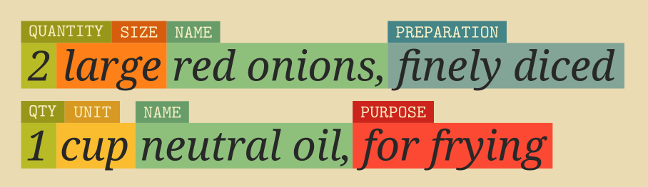
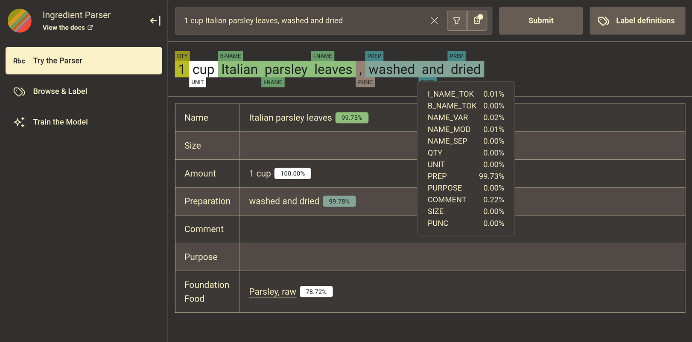
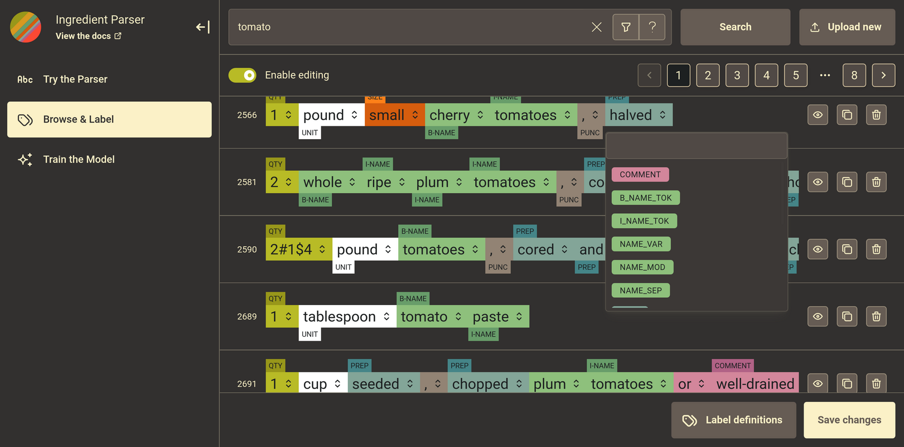
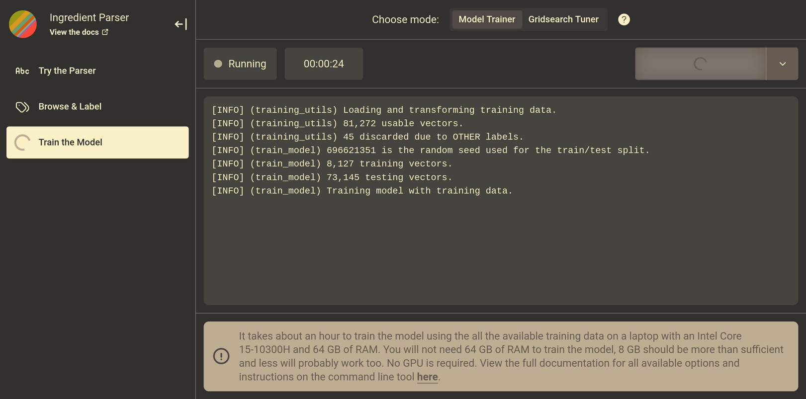

# Ingredient Parser

The Ingredient Parser package is a Python package for parsing structured information out of recipe ingredient sentences.



## Documentation

Documentation on using the package and training the model can be found at https://ingredient-parser.readthedocs.io/.

## Quick Start

Install the package using pip

```bash
$ python -m pip install ingredient-parser-nlp
```

Import the ```parse_ingredient``` function and pass it an ingredient sentence.

```python
>>> from ingredient_parser import parse_ingredient
>>> parse_ingredient("3 pounds pork shoulder, cut into 2-inch chunks")
ParsedIngredient(
    name=[IngredientText(text='pork shoulder', confidence=0.999193)],
    size=None,
    amount=[IngredientAmount(quantity='3',
                             unit=<Unit('pound')>,
                             text='3 pounds',
                             confidence=0.999906,,
                             APPROXIMATE=False,
                             SINGULAR=False)],
    preparation=IngredientText(text='cut into 2 inch chunks', confidence=0.999193),
    comment=None,
    purpose=None,
    foundation_foods=[],
    sentence='3 pounds pork shoulder, cut into 2-inch chunks'
)
```

Refer to the documentation [here](https://ingredient-parser.readthedocs.io/en/latest/start/index.html#optional-parameters) for the optional parameters that can be used with `parse_ingredient` .

## Model

The core of the library is a sequence labelling model that is used to label each token in the sentence with the part of the sentence it belongs to. A data set of 81,000 example sentences is used to train and evaluate the model. See the [Model Guide](https://ingredient-parser.readthedocs.io/en/latest/guide/index.html) in the documentation for mode details.

The model has the following accuracy on a test data set of 20% of the total data used:

```
Sentence-level results:
	Accuracy: 94.94%

Word-level results:
	Accuracy 97.90%
	Precision (micro) 97.88%
	Recall (micro) 97.90%
	F1 score (micro) 97.88%
```

## Development

**Basic**

Train and fine-tune new ingredient datasets to expand beyond the existing trained model provided in the library. The development dependencies are in the `requirements-dev.txt` file. Details on the training process can be found in the [Model Guide](https://ingredient-parser.readthedocs.io/en/latest/guide/index.html) documentation.

**Web App**

The ingredient parser library provides a convenient web interface that you can run locally to access most of the library's functionality, including using the parser, browsing the database, labelling entries, and training the model(s). View the [specific README](webtools/README.md) in webtools for a detailed overview.

| Parser | Labeller | Trainer |
| :------- | :------- | :------- |
|      |      |    |

**Documentation**

The dependencies for building the documentation are in the `requirements-doc.txt` file.

**Contribution**

Please target the **develop** branch for pull requests. The **main** branch is used for stable releases and hotfixes only.

Before committing anything, install [pre-commit](https://pre-commit.com/) and run the following to install the hooks:

```bash
$ pre-commit install
```

Pre-commit hooks cover both the main python library code and the web app (webtools) code.
