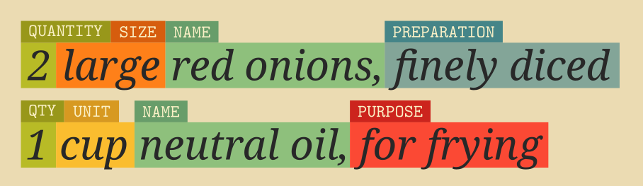
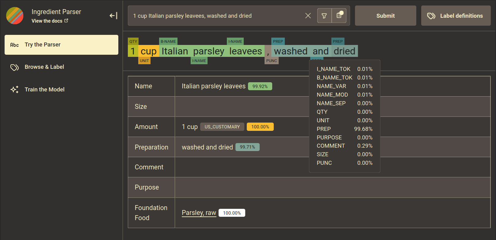
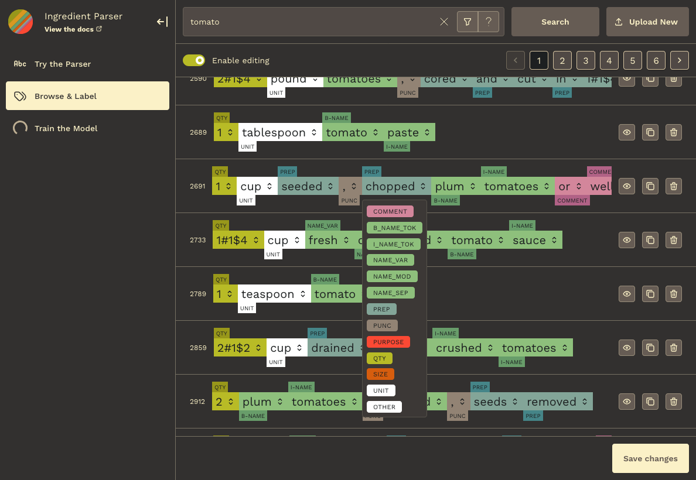
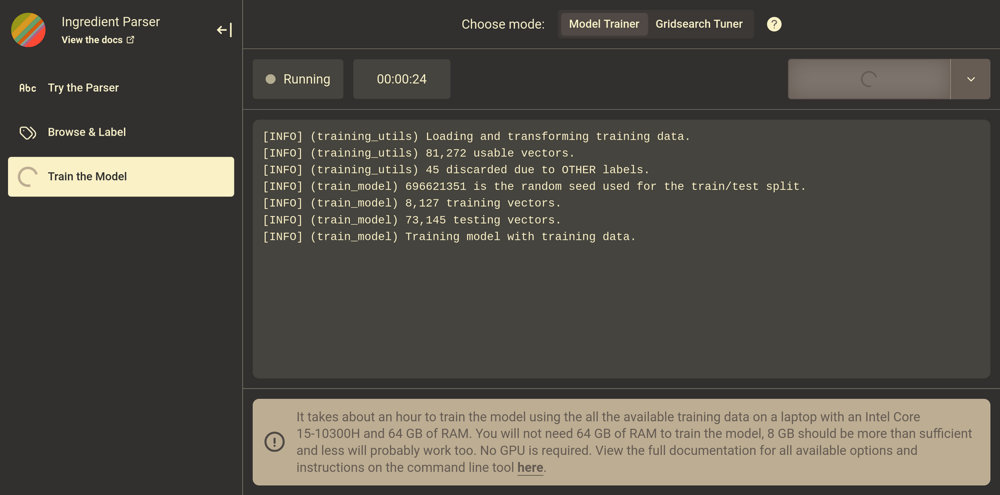

# Ingredient Parser

The Ingredient Parser package is a Python package for parsing structured information out of recipe ingredient sentences.



## Documentation

Documentation on using the package and training the model can be found at https://ingredient-parser.readthedocs.io/.

## Quick Start

Install the package using pip

```bash
$ python -m pip install ingredient-parser-nlp
```

Import the ```parse_ingredient``` function and pass it an ingredient sentence.

```python
>>> from ingredient_parser import parse_ingredient
>>> parse_ingredient("3 pounds pork shoulder, cut into 2-inch chunks")
ParsedIngredient(
    name=[IngredientText(text='pork shoulder', confidence=0.996867, starting_index=2)],
    size=None,
    amount=[IngredientAmount(quantity=Fraction(3, 1),
                             quantity_max=Fraction(3, 1),
                             unit=<Unit('pound')>,
                             text='3 pounds',
                             confidence=0.999982,
                             starting_index=0,
                             unit_system=<UnitSystem.US_CUSTOMARY: 'us_customary'>,
                             APPROXIMATE=False,
                             SINGULAR=False,
                             RANGE=False,
                             MULTIPLIER=False,
                             PREPARED_INGREDIENT=False)],
	preparation=IngredientText(text='cut into 2 inch chunks',
                               confidence=0.999946,
                               starting_index=5),
	comment=None,
	purpose=None,
	foundation_foods=[],
	sentence='3 pounds pork shoulder, cut into 2-inch chunks'
)
```

Refer to the documentation [here](https://ingredient-parser.readthedocs.io/en/latest/tutorials/options.html) for the optional parameters that can be used with `parse_ingredient` .

## Model

The core of the library is a sequence labelling model that is used to label each token in the sentence with the part of the sentence it belongs to. A data set of over 81,000 example sentences is used to train and evaluate the model. See the [Explanation](https://ingredient-parser.readthedocs.io/en/latest/explanation/index.html) section of the documentation for more details.

The model has the following accuracy on a test data set of 20% of the total data used:

```
╒══════════════════════════╤══════════════════════════╕
│ Sentence-level results   │ Word-level results       │
╞══════════════════════════╪══════════════════════════╡
│ Accuracy: 95.62%         │ Accuracy: 98.26%         │
│                          │ Precision (micro) 98.25% │
│                          │ Recall (micro) 98.26%    │
│                          │ F1 score (micro) 98.25%  │
╘══════════════════════════╧══════════════════════════╛
```

## Development

**Basic**

Train and fine-tune new ingredient datasets to expand beyond the existing trained model provided in the library. The development dependencies are in the `requirements-dev.txt` file. Details on the training process can be found in the [Explanation](https://ingredient-parser.readthedocs.io/en/latest/explanation/index.html) documentation.

**Web App**

The ingredient parser library provides a convenient web interface that you can run locally to access most of the library's functionality, including using the parser, browsing the database, labelling entries, and training the model(s). View the [specific README](webtools/README.md) in webtools for a detailed overview.

| Parser | Labeller | Trainer |
| :------- | :------- | :------- |
|      |      |    |

**Documentation**

The dependencies for building the documentation are in the `requirements-doc.txt` file.

**Tests**

The ingredient parser library has extensive test coverage. The [pytest](https://docs.pytest.org/en/stable/) framework is used for testing, and [coverage.py](https://coverage.readthedocs.io) is used to measure test coverage.

```
# Run the test suite
$ pytest

# Evaluate test coverage
$ coverage run -m pytest
# Generate coverage report
$ coverage html
````

**Contribution**

Please target the **develop** branch for pull requests. The **main** branch is used for stable releases and hotfixes only.

Before committing anything, install [pre-commit](https://pre-commit.com/) and run the following to install the hooks:

```bash
$ pre-commit install
```

Pre-commit hooks cover both the main python library code and the web app (webtools) code.
