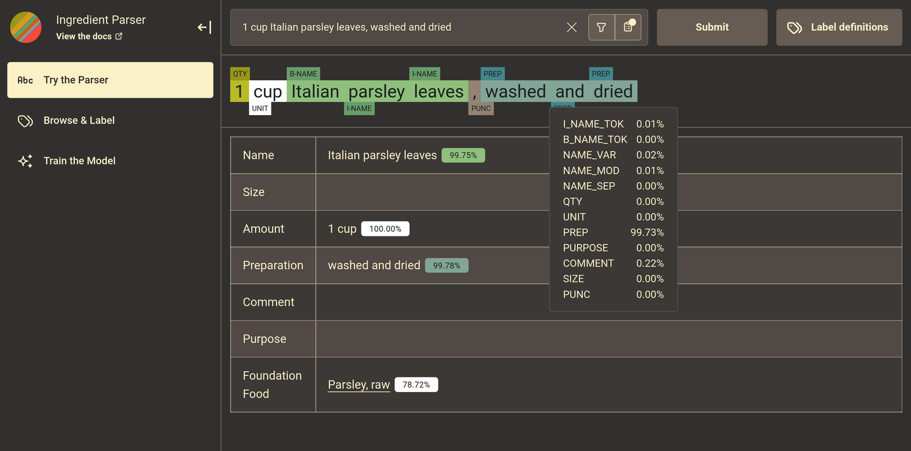

## Requirements and Setup

To run the web app, install all python libraries in `requirements-dev.txt`. Separately install [Node](https://nodejs.org/en/download), the Javascript runtime, on your machine. Lastly, navigate to the `webtools` directory and run the following commands:

```bash
$ npm install
$ npm run dev
```

The compiler will build a react/typescript bundle through `vite`, and the runtime will serve up a backend through `flask` that handles the static html and basic API requests on one instance (port), and web socket API requests on another instance (port).

## Screenshots

| Parser | Labeller | Trainer |
| :------- | :------- | :------- |
|      |      |    |


## Development Ethos & Stack

Similar the actual `Ingredient Parser` python library itself, the webtools package, at runtime, does not require any remote resources or outside server requests. During compile or build time after installation, the web tooling libraries may require fetching remote resources depending on your local machine's configuration. The web technology stack (packages, libraries, & tooling) includes: [Typescript](https://www.typescriptlang.org/), [React](https://react.dev/), [Mantine](https://mantine.dev/), [Zustand](https://zustand-demo.pmnd.rs/), [Vite](https://vite.dev/), [BiomeJS](https://vite.dev/), [Socket.IO](https://socket.io/), [Flask](https://flask.palletsprojects.com/en/stable/), [Flask-SocketIO](https://flask-socketio.readthedocs.io/en/latest/), and [Flask-CORS](https://corydolphin.com/flask-cors/). View the main repository [README](./../README.md) on notes about development contributions, and things to be aware of.


## Code Heirarchy

The heirarchy follows a WYSIWYG style directory. The client has three main feature tabs, i.e. pages, which includes the parser, labeller, and trainer. The flask server runs separate instances, one in `app.py` (for most html/API requests) and the other in `app.sockets.py` (for training API requests). Training models can become resource intensive and has unique logging behavior, both of which necessitate a separate web socket server.

```
assets
  | {images}

components
  | {labeller} > "browse & label" UI components
  | {parser} > "try the parser" UI components
  | {train} > "train the model" UI components
  | shared

domain
  | api > endpoint resolvers
  | collections > static data lists or jsons
  | store > zustrand store for app state
  | types > typescript interfaces

styles
  | css > custom styling
  | mantine > vendor specific styling

app.py > runs the basic api server
app.sockets.py > runs the web socket server
```
